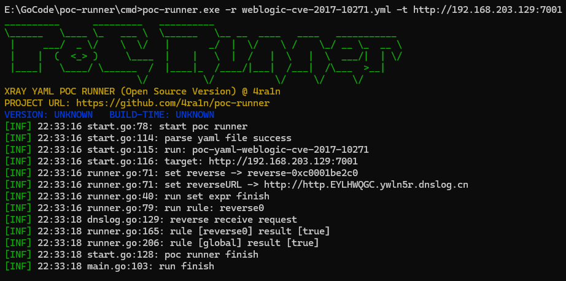
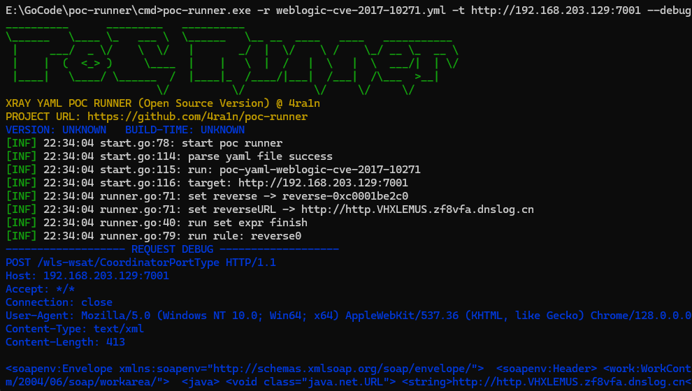
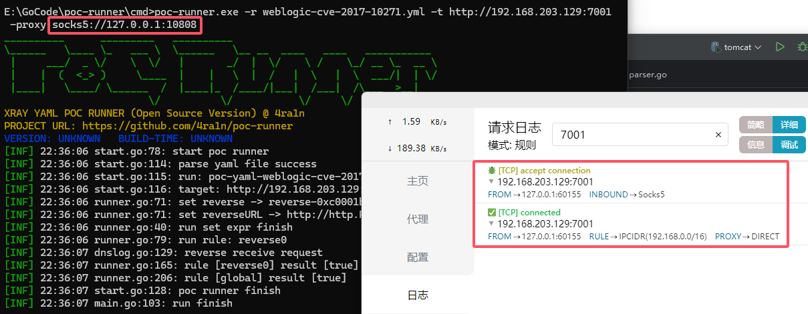
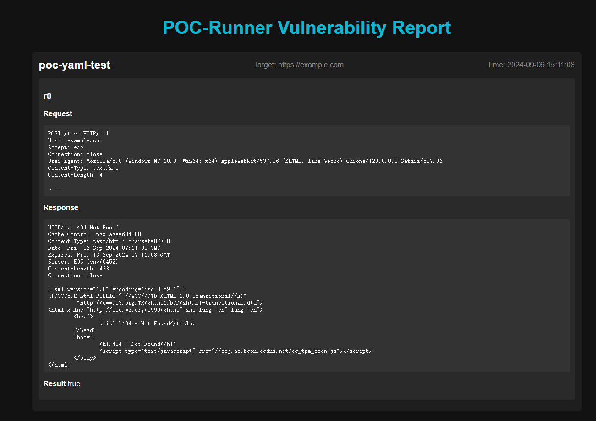
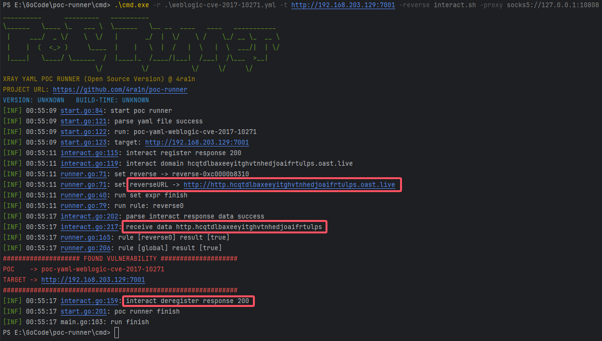

# poc-runner

[CHANGE LOG](CHANGELOG.MD)


[前往下载](https://github.com/4ra1n/poc-runner/releases)

## DESC

XRAY POC RUNNER (Open Source Version)

这是一个 `XRAY` 的 `YAML` 开源执行器（虽然网上已经有很多个开源实现了）

可执行文件体积 **非常小**（例如 `windows-amd64` 仅 `2 MB`）

主要特性:

- 完全开源（所有代码开源不存在闭源二进制文件）
- 无需复杂的 `yaml` 配置文件且命令行参数尽可能简化
- 完全不使用 `google/cel` 库（使用底层 `antlr` 实现更轻量的表达式解析）
- 完全不使用 `net/http` 库（使用 `net.Dial` 从零实现 `raw http client`）

反连内置了 `dnslog.cn` 和 `projectdiscovery/interactsh` 无需配置直接使用

注意：本项目 **不提供** 任何 `POC` 规则文件（仅提供执行引擎）

`POC` 仓库: https://github.com/chaitin/xray/tree/master/pocs

> 仅供个人学习和研究使用，请勿用于非法用途

## Quick Start

基础使用 `poc-runner -r [poc].yml -t [target]`



加入 `-debug` 打印所有请求响应



加入 `-proxy` 参数启动代理



`HTML` 报告页面



## 反连

默认使用 `dnslog.cn` 作为反连

你可以使用 `-reverse interact.sh` 指定使用 `projectdiscovery/interactsh`



由于网络原因，建议搭配代理使用

```shell
./poc-runner -r [poc].yml -t http://target -reverse interact.sh -proxy socks5://127.0.0.1:10808
```

## API

Get

```shell
go get github.com/4ra1n/poc-runner/api@0.0.3
```

Example

```go
package main

import (
	"context"
	"fmt"

	"github.com/4ra1n/poc-runner/api"
)

var poc = `name: poc-yaml-test
transport: http
set:
  rand: randomInt(200000000, 210000000)
rules:
  r0:
    request:
      cache: true
      method: POST
      path: /test
      headers:
        Content-Type: text/xml
      body: test
      follow_redirects: false
    expression: response.status == 404
expression: r0()`

func main() {
	ctx := context.Background()
	runner, err := api.NewPocRunner(ctx)
	if err != nil {
		return
	}
	report, err := runner.Run([]byte(poc), "https://example.com")
	if err != nil {
		return
	}
	fmt.Println(report)
}
```

## BUILD

WINDOWS: 参考 `build.bat`

LINUX: 参考 `.github/build.yml`

## CONTRIBUTE

Thank you for your interest in contributing to the poc-runner project

欢迎师傅们贡献 `poc-runner` 项目，所有 `PR` 都会经过 `CODE REVIEW`

注意：请尽量不要引入第三方库，尽可能使用标准库实现功能，本项目的宗旨是轻量

## SUPPORT

type

| yaml type | golang type         | support version |
|:----------|:--------------------|:----------------|
| int       | int                 | 0.0.1           |
| string    | string              | 0.0.1           |
| bool      | bool                | 0.0.1           |
| bytes     | \[\]byte            | 0.0.1           |
| map       | map\[string\]string | 0.0.1           |
| object    | interface           | 0.0.1           |

response variables

| name                  | type   | support version |
|:----------------------|:-------|:----------------|
| response.status       | int    | 0.0.1           |
| response.headers      | map    | 0.0.1           |
| response.content_type | string | 0.0.1           |
| response.body         | bytes  | 0.0.1           |
| response.body_string  | string | 0.0.1           |

string function

| name      | args   | return | support version |
|:----------|:-------|:-------|:----------------|
| bsubmatch | bytes  | map    | 0.0.1           |
| submatch  | string | map    | 0.0.1           |
| bmatches  | string | map    | 0.0.1           |
| matches   | string | map    | 0.0.1           |
| contains  | string | bool   | 0.0.1           |
| icontains | string | bool   | 0.0.1           |

bytes function

| name      | args  | return | support version |
|:----------|:------|:-------|:----------------|
| bcontains | bytes | bool   | 0.0.1           |
| icontains | bytes | bool   | 0.0.1           |

builtin function

| name            | args           | return | support version |
|:----------------|:---------------|:-------|:----------------|
| bytes           | string         | bytes  | 0.0.1           |
| string          | any            | string | 0.0.1           |
| substr          | string,int,int | string | 0.0.1           |
| sleep           | int            | bool   | 0.0.1           |
| randomInt       | int,int        | int    | 0.0.1           |
| randomLowercase | int            | string | 0.0.1           |
| randomUppercase | int            | string | 0.0.1           |
| md5             | string         | string | 0.0.1           |
| sha1            | string         | string | 0.0.1           |
| sha256          | string         | string | 0.0.1           |
| base64          | bytes\|string  | string | 0.0.1           |
| urldecode       | bytes\|string  | string | 0.0.1           |
| get404Path      | null           | string | 0.0.1           |
| newReverse      | null           | object | 0.0.1           |

reverse variables

| name           | return | support version |
|:---------------|:-------|:----------------|
| reverse.url    | string | 0.0.1           |
| reverse.rmi    | string | 0.0.1           |
| reverse.ldap   | string | 0.0.1           |
| reverse.domain | string | 0.0.1           |

reverse function

| name | args | return | support version |
|:-----|:-----|:-------|:----------------|
| wait | int  | bool   | 0.0.1           |

## TEST

以下 `POC` 已在真实漏洞环境测试通过

| plugin name                                    | result | remark  |
|:-----------------------------------------------|:-------|:--------|
| tomcat-cve-2017-12615-rce.yml                  | ✅      | /       |
| spring-cve-2016-4977.yml                       | ✅      | /       |
| apache-httpd-cve-2021-40438-ssrf.yml           | ✅      | /       |
| apache-httpd-cve-2021-41773-path-traversal.yml | ✅      | /       |
| apache-http-cve-2021-41773-rce.yml             | ✅      | /       |
| coldfusion-cve-2010-2861-lfi.yml               | ✅      | /       |
| confluence-cve-2021-26084.yml                  | ✅      | /       |
| activemq-cve-2016-3088.yml                     | ✅      | /       |
| couchdb-cve-2017-12635.yml                     | ✅      | /       |
| discuz-wooyun-2010-080723.yml                  | ✅      | /       |
| docker-api-unauthorized-rce.yml                | ✅      | /       |
| elasticsearch-cve-2014-3120.yml                | ✅      | /       |
| elasticsearch-cve-2015-1427.yml                | ✅      | /       |
| elasticsearch-cve-2015-5531.yml                | ✅      | /       |
| jenkins-cve-2018-1000861-rce.yml               | ✅      | /       |
| joomla-cve-2017-8917-sqli.yml                  | ✅      | /       |
| kibana-cve-2018-17246.yml                      | ✅      | /       |
| laravel-cve-2021-3129.yml                      | ✅      | /       |
| phpmyadmin-cve-2018-12613-file-inclusion.yml   | ✅      | /       |
| solr-cve-2017-12629-xxe.yml                    | ✅      | reverse |
| solr-cve-2019-0193.yml                         | ✅      | /       |
| weblogic-cve-2017-10271.yml                    | ✅      | reverse |
| weblogic-cve-2019-2725.yml                     | ✅      | /       |
| weblogic-cve-2019-2729-1.yml                   | ✅      | /       |
| weblogic-cve-2019-2729-2.yml                   | ✅      | /       |
| weblogic-cve-2020-14750.yml                    | ✅      | /       |
| weblogic-ssrf.yml                              | ✅      | /       |
| zabbix-cve-2016-10134-sqli.yml                 | ✅      | /       |

## Star

<div align="center">


</div>

## THANKS

部分代码参考: https://github.com/raylax/rayx

感谢
